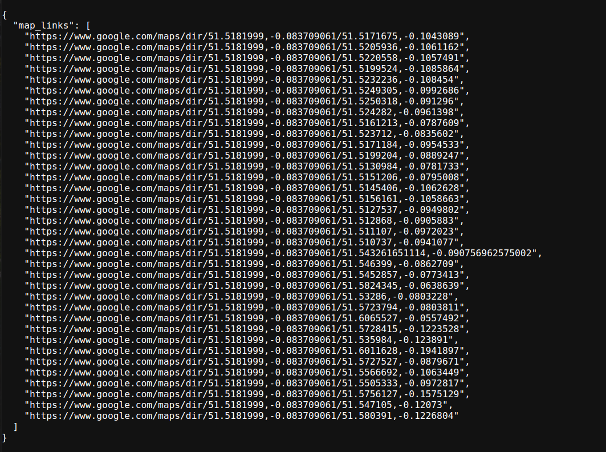
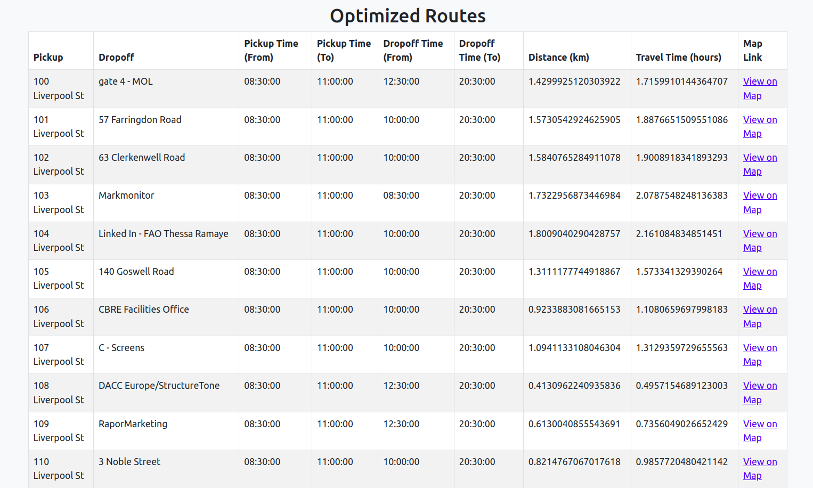

# Route Optimization Project

## Overview

This project is a Django application that optimizes delivery routes based on pickup and drop-off locations. It provides endpoints to generate optimized routes as Google Maps links, visualize raw data in a web table, and export optimized routes as CSV files.

## Setup

Follow these steps to set up the project on your local machine.

### Prerequisites

- **Python 3.7+**
- **pip** (Python package installer)
- **Django 3.0+**
- Install necessary packages by running `pip install -r requirements.txt`

### Installation Steps

1. **Clone the Repository**:
   ```bash
   git clone https://github.com/deliveryappuk/route_optimizer.git
   cd route_optimizer
   ```

2. **Set Up Virtual Environment**:
   ```bash
   python -m venv env
   source env/bin/activate  # On Windows use `env\Scripts\activate`
   ```

3. **Install Dependencies**:
   ```bash
   pip install -r requirements.txt
   ```

4. **Set Up Django Project**:
   - Ensure you have a `data` folder with a CSV file (`customer-requests-testingLondon36.csv`) in the project directory.
   - Run the Django development server:
     ```bash
     python manage.py runserver
     ```

5. **Access the Application**:
   - Open your browser and navigate to `http://127.0.0.1:8000/optimize-route/` for the JSON response with Google Maps links.
   - Navigate to `http://127.0.0.1:8000/data-source/` to view the raw data table in the browser.

## Project Structure

- **views.py**: Contains functions for handling requests to optimize routes and display data.
- **optimize_routes.py**: Defines functions for calculating distances, estimating travel time, and optimizing routes.
- **templates/optimizer/data_source.html**: Template for displaying the raw data as a table.
- **data/customer-requests-testingLondon36.csv**: Sample CSV file for testing route optimization.

## Endpoints

The project has two main endpoints:

1. **Optimize Route Endpoint**
   - **URL**: `/optimize-route/`
   - **Description**: This endpoint triggers the route optimization process. It reads the CSV file, generates optimized routes, and returns a JSON response with Google Maps links for each route.
   - **Response**:
     ```json
     {
       "map_links": [
         "https://www.google.com/maps/dir/...",
         "https://www.google.com/maps/dir/..."
       ]
     }
     ```
     

2. **Data Source Table Endpoint**
   - **URL**: `/data-source/`
   - **Description**: This endpoint loads the CSV data and displays it as a table in an HTML template. It’s useful for inspecting the raw data used for optimization.
   - **Template**: `data_source.html`
   


3. **Route Data View**
   - **URL**: `/route-data-view/`
   - **Description**: This route provides a view of detailed route data. It may include detailed information such as pickup and dropoff times, locations, distances, travel times, and more.
   - **Response**: A detailed view of the route data.
   
  

## Route Optimization Overview

The optimization logic is implemented in `optimize_routes.py` and follows these steps:

1. **Load Data**: Reads the CSV file containing delivery information with fields like pickup and drop-off locations, times, and coordinates.

2. **Set Collection Points and Delivery Windows**:
   - Each route begins with a designated **collection point**.
   - The algorithm respects **collection time windows** and assigns **defined time windows for deliveries** based on estimated travel time.

3. **Calculate Distances and Travel Time**:
   - Uses the **Haversine formula** to calculate the distance between points.
   - Adjusts travel speed dynamically based on distance, with slower speeds for short distances and an average speed for longer distances.

4. **Optimize Route by Proximity and Constraints**:
   - The algorithm selects the nearest unvisited location to form a route segment.
   - It organizes pickups and drop-offs to maximize efficiency, keeping each route within the limit of **8 hours** or **120 miles**.

5. **Generate Google Maps Link**:
   - Creates a link to visualize each optimized route in Google Maps with all the stops included.

6. **Export Data**: Each optimized route segment is saved as a CSV file containing route details like total distance, duration, and estimated drop-off times.

## How to Extend the Project

### Adding New CSV Files

To test with different datasets:
- Add your CSV file to the `data` folder.
- Update the file path in `views.py` to point to the new file.

### Customizing Route Optimization

If the optimization rules need customization (e.g., adjusting speed, adding more constraints), modify the `optimize_route` function in `optimize_routes.py`.

### Error Handling and Validation

Consider adding error handling in:
- **CSV loading**: Check for file existence and format issues.
- **Route optimization**: Handle edge cases with missing coordinates or unexpected values.

## Testing

1. **Unit Testing**:
   - Write unit tests for individual functions, especially `haversine` and `calculate_travel_time`.
   - Test route optimization logic to verify accuracy.

2. **Integration Testing**:
   - Ensure the endpoints return correct JSON structures and template rendering.
   - Test with different CSV files to validate the response and error handling.

## Additional Resources

- [Django Documentation](https://docs.djangoproject.com/)
- [Google Maps URL Parameters](https://developers.google.com/maps/documentation/urls)

---
